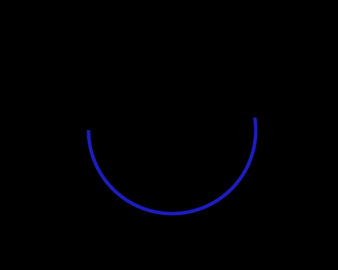

  [](https://pypi.org/project/pypen/) [](https://pypi.org/project/pypen/) [](https://pypen.readthedocs.io/en/latest/?badge=latest) [](https://scrutinizer-ci.com/g/Canvim/PyPen/?branch=master)

Express your creativity in Python through simple PyPen sketches!

# What is PyPen?
PyPen tries to be the end-all solution to creative coding in Python. It provides very easy-to-use functions for drawing primitives to the screen and getting user input.

We felt like there was always a bunch of overhead needed to get nice and simple HTML-canvas-like graphics to work in Python and that this overhead always made for a half-baked user experience.

PyPen is basically doing all of the boring stuff in the background and exposes simple functions like ```clear()```, ```circle(x, y, radius)```, ```rectangle(x, y, width, height)``` and many more for you to use and express your creativity with.

# How do I Use PyPen?

Checkout our setup tutorial: [How do I Use PyPen](./docs/EXAMPLE.md)

TL;DR:
1. type ```pip install pypen``` and follow instructions if any extra dependencies are needed.
2. type ```pypen --init example```, which will create a file named example.py in your current directory.
3. type ```pypen example``` and a window should popup with something looking like this: <br><br><br><br>
4. edit the example.py file by checking out PyPen's documentation and [examples](./examples/)

## Inspiration from our Examples:

| Example 002 | Example 003 |
|:-----------:|:-----------:|
|||

| Example 006 | Example 007 |
|:-----------:|:-----------:|
|||

| Example 010 | Example 011 |
|:-----------:|:-----------:|
|||

## _(For Maintainers)_ How does PyPen work?
We have an entire page dedicated to explaining the inner workings of PyPen. If you are a developer interested in helping PyPen's development, you should check it out: [How does PyPen _Really_ Work?](https://pypen.readthedocs.io/en/latest/behind_the_scenes.html#behind-the-scenes)

